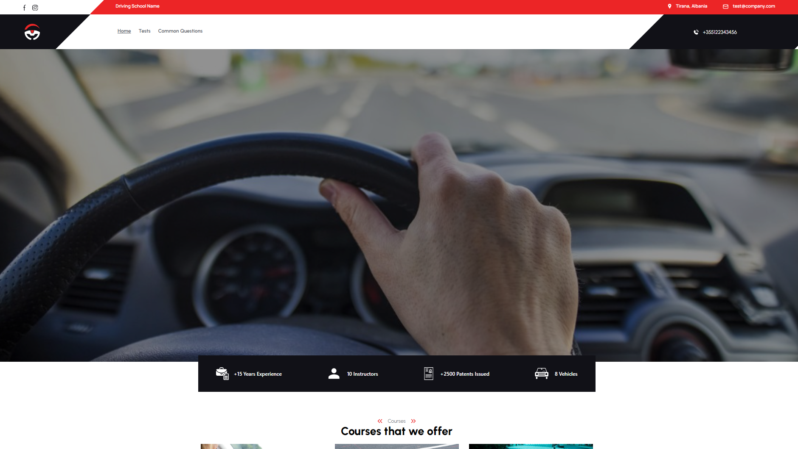
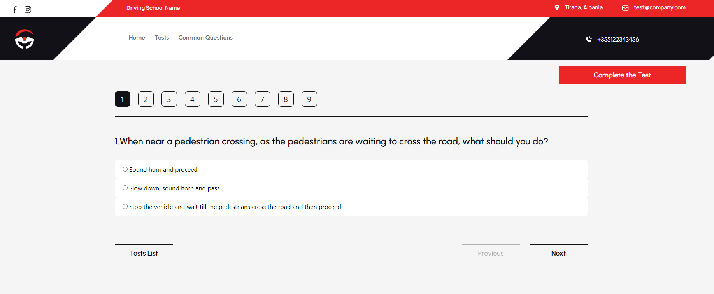

# Driving School App / ReactJS & Firebase

## [Check it live here](https://drivingschoolapp.netlify.app/)




A Driving School App made with React 18.3.1

## Getting Started

These instructions will get you a copy of the project up and running on your local machine for development and testing purposes. See deployment for notes on how to deploy the project on a live system.

### Installing

Clone the Repository and run

```
npm install
npm start
```

## Deployment

To deploy simply run

```
npm run build
```

## Built With

- [ReactJS](https://reactjs.org/)
- [React Router DOM 6.23.1](https://reactrouter.com/en/main)
- [TypeScript](https://www.typescriptlang.org/)
- [TailwindCSS](https://tailwindcss.com/)
- [HeadlessUI](https://headlessui.com/)
- [Firebase](https://firebase.google.com/)
